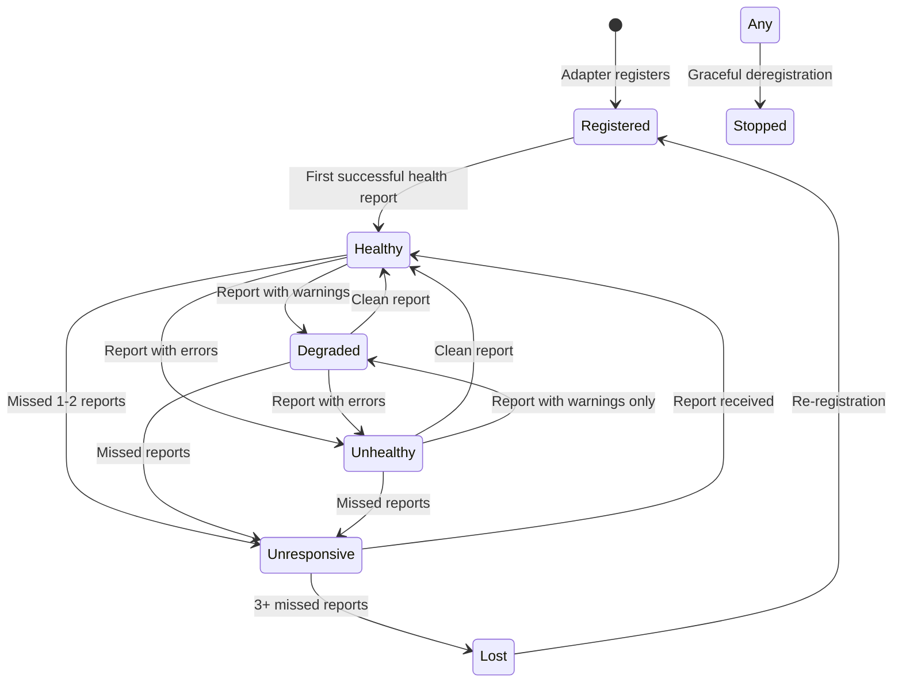

# Health Check System - Detailed Technical Specification

## 1. Data Model Specification

### 1.1 Adapter States

```rust
#[derive(Debug, Clone, Copy, PartialEq, Serialize, Deserialize)]
pub enum AdapterState {
    // Initial state when adapter registers
    Registered,     // Just registered, no health report yet
    
    // Operational states
    Healthy,        // Receiving health reports on schedule
    Degraded,       // Receiving reports but with errors/warnings
    
    // Problem states
    Unhealthy,      // Health reports indicate problems
    Unresponsive,   // Missing health reports (1-2 intervals)
    
    // Terminal states
    Stopped,        // Gracefully deregistered
    Lost,           // Missing reports for extended period (3+ intervals)
    
    // Special states
    NotApplicable,  // For Claude and CMD adapters
}
```

### 1.2 State Transition Rules



### 1.3 Timeout Configuration

```rust
pub struct HealthCheckTimeouts {
    // Time to wait after registration for first health report
    pub initial_report_grace_period: Duration,  // Default: 10 seconds
    
    // Maximum time between health reports before marking unresponsive
    pub health_report_timeout: Duration,         // Default: 2 × report_interval
    
    // Time before marking adapter as lost
    pub lost_timeout: Duration,                  // Default: 3 × report_interval
    
    // Time to keep registration data after adapter is lost
    pub registration_ttl: Duration,              // Default: 24 hours
    
    // Cleanup interval for stale registrations
    pub cleanup_interval: Duration,              // Default: 1 hour
}

impl Default for HealthCheckTimeouts {
    fn default() -> Self {
        Self {
            initial_report_grace_period: Duration::from_secs(10),
            health_report_timeout: Duration::from_secs(60),  // Assuming 30s default interval
            lost_timeout: Duration::from_secs(90),
            registration_ttl: Duration::from_secs(86400),
            cleanup_interval: Duration::from_secs(3600),
        }
    }
}
```

### 1.4 Complete Data Structures

```rust
#[derive(Debug, Clone, Serialize, Deserialize)]
pub struct AdapterRegistration {
    // Identity
    pub registration_id: Uuid,
    pub adapter_id: String,          // e.g., "gitlab", "calendar"
    pub display_name: String,         // e.g., "GitLab CI"
    pub version: String,              // Semantic version
    
    // Timing
    pub registered_at: DateTime<Utc>,
    pub last_seen_at: DateTime<Utc>,
    pub last_health_report_at: Option<DateTime<Utc>>,
    
    // State
    pub state: AdapterState,
    pub state_changed_at: DateTime<Utc>,
    pub state_history: Vec<StateTransition>,  // Last 10 transitions
    
    // Configuration
    pub capabilities: AdapterCapabilities,
    pub expected_report_interval: Duration,
    pub consecutive_misses: u32,
    
    // Metrics
    pub health_metrics: HealthMetrics,
    pub lifetime_metrics: LifetimeMetrics,
    
    // Metadata
    pub metadata: HashMap<String, String>,
    pub source_ip: IpAddr,  // For security validation
}

#[derive(Debug, Clone, Serialize, Deserialize)]
pub struct StateTransition {
    pub from_state: AdapterState,
    pub to_state: AdapterState,
    pub timestamp: DateTime<Utc>,
    pub reason: String,
}

#[derive(Debug, Clone, Serialize, Deserialize)]
pub struct AdapterCapabilities {
    pub supports_health_check: bool,
    pub health_check_interval_seconds: u32,
    pub supports_metrics: bool,
    pub supports_graceful_shutdown: bool,
    pub supports_hot_reload: bool,
    pub max_concurrent_races: Option<u32>,
}

#[derive(Debug, Clone, Default, Serialize, Deserialize)]
pub struct HealthMetrics {
    pub is_healthy: bool,
    pub error_count: u32,
    pub warning_count: u32,
    pub response_time_ms: Option<u64>,
    pub cpu_usage_percent: Option<f32>,
    pub memory_usage_mb: Option<u64>,
    pub active_tasks: u32,
    pub queue_depth: u32,
}

#[derive(Debug, Clone, Default, Serialize, Deserialize)]
pub struct LifetimeMetrics {
    pub total_races_created: u64,
    pub total_races_updated: u64,
    pub total_errors: u64,
    pub total_restarts: u32,
    pub uptime_seconds: u64,
    pub last_error: Option<String>,
    pub last_error_at: Option<DateTime<Utc>>,
}
```

## 2. API Specification

### 2.1 HTTP REST Endpoints

#### Registration Endpoint
```http
POST /api/v1/adapter/register
Host: 127.0.0.1:7777
Content-Type: application/json
X-Adapter-Token: <optional-shared-secret>

Request:
{
  "adapter_id": "gitlab",
  "display_name": "GitLab CI",
  "version": "1.0.0",
  "capabilities": {
    "supports_health_check": true,
    "health_check_interval_seconds": 30,
    "supports_metrics": true,
    "supports_graceful_shutdown": true,
    "supports_hot_reload": false,
    "max_concurrent_races": 10
  },
  "metadata": {
    "pid": "12345",
    "config_path": "/etc/raceboard/gitlab.toml",
    "started_at": "2024-01-09T10:00:00Z"
  }
}

Response: 201 Created
{
  "registration_id": "550e8400-e29b-41d4-a716-446655440000",
  "server_time": "2024-01-09T10:00:00Z",
  "state": "Registered",
  "expected_report_interval_seconds": 30,
  "initial_report_deadline": "2024-01-09T10:00:10Z"
}

Error Responses:
400 Bad Request - Invalid adapter_id or missing required fields
409 Conflict - Adapter already registered (must deregister first)
403 Forbidden - Request not from localhost
```

#### Health Report Endpoint
```http
POST /api/v1/adapter/health
Host: 127.0.0.1:7777
Content-Type: application/json
X-Registration-Id: 550e8400-e29b-41d4-a716-446655440000

Request:
{
  "adapter_id": "gitlab",
  "health_metrics": {
    "is_healthy": true,
    "error_count": 0,
    "warning_count": 2,
    "response_time_ms": 150,
    "cpu_usage_percent": 15.5,
    "memory_usage_mb": 128,
    "active_tasks": 3,
    "queue_depth": 5
  },
  "lifetime_metrics": {
    "total_races_created": 1024,
    "total_races_updated": 2048,
    "total_errors": 5,
    "uptime_seconds": 3600
  }
}

Response: 200 OK
{
  "state": "Healthy",
  "next_report_expected_by": "2024-01-09T10:01:00Z"
}

Error Responses:
404 Not Found - Registration ID not found
403 Forbidden - Request not from localhost
410 Gone - Registration expired (adapter must re-register)
```

#### Deregistration Endpoint
```http
DELETE /api/v1/adapter/register/{registration_id}
Host: 127.0.0.1:7777
X-Registration-Id: 550e8400-e29b-41d4-a716-446655440000

Response: 204 No Content

Error Responses:
404 Not Found - Registration ID not found
403 Forbidden - Request not from localhost
```

#### Status Query Endpoints (for UI/Monitoring)
```http
GET /api/v1/adapter/status
Host: 127.0.0.1:7777

Response: 200 OK
{
  "adapters": [
    {
      "adapter_id": "gitlab",
      "display_name": "GitLab CI",
      "state": "Healthy",
      "version": "1.0.0",
      "registered_at": "2024-01-09T10:00:00Z",
      "last_health_report_at": "2024-01-09T10:30:00Z",
      "uptime_seconds": 1800,
      "metrics": { ... }
    },
    {
      "adapter_id": "claude",
      "display_name": "Claude Adapter",
      "state": "NotApplicable",
      "note": "Hook-based adapter, always available"
    }
  ],
  "summary": {
    "total_adapters": 6,
    "registered_adapters": 4,
    "healthy_adapters": 3,
    "unhealthy_adapters": 1,
    "unresponsive_adapters": 0
  }
}

GET /api/v1/adapter/status/{adapter_id}
Response: Detailed status for specific adapter
```

### 2.2 gRPC Service Evolution

```protobuf
// Extend existing race.proto

service AdapterService {
  // For adapters to register (not used by Claude/CMD)
  rpc RegisterAdapter(RegisterAdapterRequest) returns (RegisterAdapterResponse);
  
  // For adapters to send health reports
  rpc ReportHealth(HealthReportRequest) returns (HealthReportResponse);
  
  // For adapters to deregister
  rpc DeregisterAdapter(DeregisterAdapterRequest) returns (google.protobuf.Empty);
  
  // For UI to get adapter status
  rpc GetAdapterStatus(google.protobuf.Empty) returns (AdapterStatusResponse);
  
  // For UI to stream adapter status updates
  rpc StreamAdapterStatus(google.protobuf.Empty) returns (stream AdapterStatusUpdate);
}

message RegisterAdapterRequest {
  string adapter_id = 1;
  string display_name = 2;
  string version = 3;
  AdapterCapabilities capabilities = 4;
  map<string, string> metadata = 5;
}

message RegisterAdapterResponse {
  string registration_id = 1;
  google.protobuf.Timestamp server_time = 2;
  AdapterState state = 3;
  uint32 expected_report_interval_seconds = 4;
}

message HealthReportRequest {
  string adapter_id = 1;
  string registration_id = 2;
  HealthMetrics health_metrics = 3;
  LifetimeMetrics lifetime_metrics = 4;
}

message HealthReportResponse {
  AdapterState state = 1;
  google.protobuf.Timestamp next_report_deadline = 2;
}
```

## 3. Security & Trust Model

### 3.1 Local-Only Binding

```rust
// Server configuration
pub struct SecurityConfig {
    // Bind addresses - MUST be localhost only
    pub adapter_api_bind: IpAddr,     // Default: 127.0.0.1
    pub adapter_api_port: u16,        // Default: 7778 (separate from main API)
    
    // IP validation
    pub allow_only_localhost: bool,   // Default: true
    pub allowed_ips: Vec<IpAddr>,     // Default: [127.0.0.1, ::1]
    
    // Optional authentication
    pub require_shared_secret: bool,  // Default: false
    pub shared_secret: Option<String>,
    
    // Rate limiting
    pub max_registrations_per_minute: u32,  // Default: 10
    pub max_health_reports_per_minute: u32, // Default: 120
}

// Middleware for enforcing localhost-only
pub async fn enforce_localhost(
    req: HttpRequest,
    next: Next<B>,
) -> Result<Response, Error> {
    let peer_addr = req.peer_addr()
        .ok_or_else(|| ErrorForbidden("No peer address"))?;
    
    let is_localhost = match peer_addr.ip() {
        IpAddr::V4(ip) => ip.is_loopback(),
        IpAddr::V6(ip) => ip.is_loopback(),
    };
    
    if !is_localhost {
        return Err(ErrorForbidden("Only localhost connections allowed"));
    }
    
    next.call(req).await
}
```

### 3.2 Registration Security

```rust
impl AdapterRegistry {
    pub async fn validate_registration(&self, req: &RegisterRequest) -> Result<()> {
        // 1. Check source IP
        if !self.is_localhost(&req.source_ip) {
            return Err(Error::Forbidden("Non-local registration attempt"));
        }
        
        // 2. Check for duplicate registration
        if self.is_already_registered(&req.adapter_id).await {
            return Err(Error::Conflict("Adapter already registered"));
        }
        
        // 3. Validate adapter_id format (alphanumeric + dash only)
        if !req.adapter_id.chars().all(|c| c.is_alphanumeric() || c == '-') {
            return Err(Error::BadRequest("Invalid adapter_id format"));
        }
        
        // 4. Check rate limiting
        if self.exceeds_rate_limit(&req.source_ip).await {
            return Err(Error::TooManyRequests("Registration rate limit exceeded"));
        }
        
        // 5. Optional: Verify shared secret
        if self.config.require_shared_secret {
            if req.shared_secret != self.config.shared_secret {
                return Err(Error::Unauthorized("Invalid shared secret"));
            }
        }
        
        Ok(())
    }
}
```

### 3.3 Health Report Validation

```rust
impl AdapterRegistry {
    pub async fn validate_health_report(&self, req: &HealthReportRequest) -> Result<()> {
        // 1. Check source IP matches registration
        let registration = self.get_registration(&req.registration_id).await?;
        if req.source_ip != registration.source_ip {
            return Err(Error::Forbidden("IP address mismatch"));
        }
        
        // 2. Check registration is not expired
        if registration.is_expired() {
            return Err(Error::Gone("Registration expired"));
        }
        
        // 3. Validate metrics are reasonable
        if let Some(cpu) = req.health_metrics.cpu_usage_percent {
            if cpu > 100.0 || cpu < 0.0 {
                return Err(Error::BadRequest("Invalid CPU usage"));
            }
        }
        
        // 4. Check rate limiting
        if self.exceeds_health_rate_limit(&req.registration_id).await {
            return Err(Error::TooManyRequests("Health report rate limit exceeded"));
        }
        
        Ok(())
    }
}
```

### 3.4 Defense Against Attacks

```rust
pub struct SecurityDefenses {
    // DDoS Protection
    pub rate_limiter: RateLimiter,
    pub max_concurrent_connections: u32,  // Default: 100
    
    // Resource Protection  
    pub max_registrations: u32,           // Default: 50
    pub max_request_size: usize,          // Default: 1MB
    pub request_timeout: Duration,        // Default: 5 seconds
    
    // Audit Logging
    pub log_registration_attempts: bool,  // Default: true
    pub log_failed_health_reports: bool,  // Default: true
    pub alert_on_suspicious_activity: bool, // Default: true
}

// Example: Detect suspicious patterns
pub async fn detect_suspicious_activity(registry: &AdapterRegistry) {
    // Alert if multiple registration attempts from same adapter
    if registry.count_recent_registrations("gitlab") > 3 {
        log::warn!("Multiple registration attempts from gitlab adapter");
    }
    
    // Alert if health reports from unregistered adapter
    if registry.has_unregistered_health_reports().await {
        log::warn!("Health reports from unregistered adapters detected");
    }
    
    // Alert if registration from non-standard port
    if registry.has_non_standard_ports().await {
        log::warn!("Registration attempts from non-standard ports");
    }
}
```

## 4. Implementation Priority

### Phase 1: Core Security (Critical)
1. Implement localhost-only binding
2. Add IP validation middleware
3. Create rate limiting

### Phase 2: Data Model (High)
1. Implement state machine
2. Add timeout handling
3. Create cleanup jobs

### Phase 3: API Surface (High)
1. Implement REST endpoints
2. Add gRPC service
3. Create OpenAPI documentation

### Phase 4: Monitoring (Medium)
1. Add audit logging
2. Implement metrics collection
3. Create alerting rules

## 5. Testing Requirements

### Unit Tests
```rust
#[cfg(test)]
mod tests {
    #[test]
    fn test_state_transitions() {
        // Test all valid state transitions
        // Test invalid transitions are rejected
    }
    
    #[test]
    fn test_timeout_calculations() {
        // Test timeout based on report interval
        // Test grace period handling
    }
    
    #[test]
    fn test_localhost_validation() {
        // Test IPv4 localhost accepted
        // Test IPv6 localhost accepted
        // Test remote IPs rejected
    }
}
```

### Integration Tests
- Test registration flow end-to-end
- Test health reporting with timeouts
- Test cleanup of stale registrations
- Test rate limiting under load

### Security Tests
- Test non-localhost connections are rejected
- Test rate limiting prevents DoS
- Test invalid data is rejected
- Test registration conflicts handled correctly

## 6. Monitoring & Observability

### Metrics to Track
```rust
// Prometheus metrics
adapter_registrations_total{adapter_id}
adapter_health_reports_total{adapter_id, state}
adapter_state_transitions_total{from_state, to_state}
adapter_registration_errors_total{error_type}
adapter_uptime_seconds{adapter_id}
adapter_last_seen_timestamp{adapter_id}
```

### Alerts to Configure
- Adapter unresponsive for > 2 minutes
- Multiple failed registration attempts
- Suspicious activity patterns
- Rate limit violations

## 7. Migration Checklist

- [ ] Implement security middleware
- [ ] Create state machine with transitions
- [ ] Add timeout handling
- [ ] Implement REST endpoints with validation
- [ ] Add gRPC service methods
- [ ] Create cleanup background job
- [ ] Add comprehensive logging
- [ ] Write integration tests
- [ ] Document API with OpenAPI/Swagger
- [ ] Deploy with monitoring