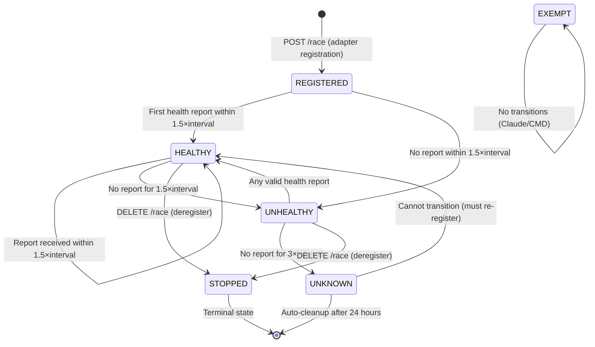

> Moved — This draft is superseded by `HEALTH_CHECK_SPEC.md`.

# (Historical) Health Check System - Unified API Specification

## Reusing Existing Race Endpoints (Breaking Changes)

### Core Insight
NOTE: The race-based health approach was replaced by a dedicated REST adapter registry. See `HEALTH_CHECK_SPEC.md` for the canonical API.

## 1. Identity Model Using Race IDs

```rust
// Adapter instances are races with special IDs
pub struct AdapterInstanceId {
    // Race ID format: "adapter:{type}:{instance}"
    // Examples:
    //   "adapter:gitlab:prod-1"
    //   "adapter:gitlab:dev"
    //   "adapter:calendar:default"
    //   "adapter:codex-watch:folder-1"
}

impl AdapterInstanceId {
    pub fn to_race_id(&self) -> String {
        format!("adapter:{}:{}", self.adapter_type, self.instance_id)
    }
    
    pub fn from_race_id(race_id: &str) -> Option<Self> {
        if !race_id.starts_with("adapter:") {
            return None;
        }
        
        let parts: Vec<&str> = race_id.splitn(3, ':').collect();
        if parts.len() != 3 {
            return None;
        }
        
        Some(Self {
            adapter_type: parts[1].to_string(),
            instance_id: parts[2].to_string(),
        })
    }
}
```

## 2. Registration via POST /race

```http
POST /race
Content-Type: application/json
Authorization: Bearer <token-from-login-helper>

{
  "id": "adapter:gitlab:prod-1",
  "source": "adapter-health",
  "title": "GitLab CI (Production)",
  "state": "running",
  "started_at": "2024-01-09T10:00:00Z",
  "metadata": {
    "adapter_type": "gitlab",
    "instance_id": "prod-1",
    "version": "1.0.0",
    "pid": "12345",
    "config_path": "/etc/raceboard/gitlab-prod.toml",
    "health_interval_seconds": "30",
    "supports_health_check": "true",
    "parent_pid": "1234",  // Login Item Helper PID
    "launch_token": "token-from-helper"
  }
}

Response: 200 OK (or 201 Created)
{
  "id": "adapter:gitlab:prod-1",
  "source": "adapter-health",
  "title": "GitLab CI (Production)",
  "state": "running",
  // ... full race object
}
```

## 3. Health Reports via PATCH /race/{id}

```http
PATCH /race/adapter:gitlab:prod-1
Content-Type: application/json
Authorization: Bearer <token-from-login-helper>

{
  "state": "running",  // or "failed" if unhealthy
  "progress": 100,     // Always 100 for healthy adapters
  "eta_sec": 30,       // Next health report in 30 seconds
  "metadata": {
    "last_health_report": "2024-01-09T10:01:00Z",
    "health_status": "healthy",
    "cpu_usage_percent": "15.5",
    "memory_usage_mb": "128",
    "active_tasks": "3",
    "queue_depth": "5",
    "races_created": "1024",
    "races_updated": "2048",
    "errors_last_hour": "0",
    "warnings_last_hour": "2"
  }
}

Response: 200 OK
{
  "id": "adapter:gitlab:prod-1",
  // ... updated race object
}
```

## 4. Deregistration via DELETE /race/{id}

```http
DELETE /race/adapter:gitlab:prod-1
Authorization: Bearer <token-from-login-helper>

Response: 204 No Content
```

## 5. Query Adapter Status via GET /races

```http
GET /races?source=adapter-health

Response: 200 OK
{
  "races": [
    {
      "id": "adapter:gitlab:prod-1",
      "source": "adapter-health",
      "title": "GitLab CI (Production)",
      "state": "running",
      "started_at": "2024-01-09T10:00:00Z",
      "metadata": {
        "adapter_type": "gitlab",
        "instance_id": "prod-1",
        "health_status": "healthy",
        "last_health_report": "2024-01-09T10:30:00Z",
        // ...
      }
    },
    {
      "id": "adapter:calendar:default",
      "source": "adapter-health",
      "title": "Google Calendar",
      "state": "failed",  // Unhealthy
      "metadata": {
        "health_status": "unhealthy",
        "last_error": "Connection timeout",
        // ...
      }
    }
  ]
}
```

## 6. Strict Status Model

### 6.1 Adapter Status States

```rust
#[derive(Debug, Clone, Copy, PartialEq, Serialize, Deserialize)]
pub enum AdapterHealthStatus {
    // Initial state when adapter first registers
    REGISTERED,     // Just registered, no health report yet
                   // Timer: Must report within 1.5×interval or → UNHEALTHY
    
    // Normal operation - receiving timely health reports
    HEALTHY,        // Last report received within 1.5×interval
                   // Timer: If no report within 1.5×interval → UNHEALTHY
    
    // Degraded - late but still responding
    UNHEALTHY,      // Last report between 1.5×interval and 3×interval
                   // Timer: If no report within 3×interval → UNKNOWN
                   // Recovery: Any valid report → HEALTHY
    
    // Lost contact - no recent reports
    UNKNOWN,        // No report for more than 3×interval
                   // Timer: After 24 hours → auto-cleanup (remove race)
                   // Recovery: New registration required (adapter must re-register)
    
    // Clean shutdown
    STOPPED,        // Adapter explicitly deregistered
                   // Terminal state - race can be deleted
    
    // Special case for non-health-check adapters
    EXEMPT,         // Claude and CMD adapters - no health checks expected
}
```

### 6.2 State Transition Diagram



### 6.3 Timing Rules

```rust
pub struct HealthTimingRules {
    // Base interval from adapter registration
    pub health_interval: Duration,        // e.g., 30 seconds (from metadata)
    
    // State transition thresholds
    pub healthy_threshold: f32,           // 1.5× interval (45s for 30s interval)
    pub unhealthy_threshold: f32,         // 3.0× interval (90s for 30s interval)
    pub unknown_cleanup: Duration,        // 24 hours
    
    // Grace periods
    pub initial_grace_period: Duration,   // 10 seconds after registration
}

impl HealthTimingRules {
    pub fn from_interval_seconds(seconds: u32) -> Self {
        let interval = Duration::from_secs(seconds as u64);
        
        Self {
            health_interval: interval,
            healthy_threshold: 1.5,
            unhealthy_threshold: 3.0,
            unknown_cleanup: Duration::from_secs(86400), // 24 hours
            initial_grace_period: Duration::from_secs(10),
        }
    }
    
    pub fn time_until_unhealthy(&self) -> Duration {
        Duration::from_secs_f32(self.health_interval.as_secs_f32() * self.healthy_threshold)
    }
    
    pub fn time_until_unknown(&self) -> Duration {
        Duration::from_secs_f32(self.health_interval.as_secs_f32() * self.unhealthy_threshold)
    }
    
    pub fn classify_status(&self, time_since_last_report: Duration) -> AdapterHealthStatus {
        if time_since_last_report <= self.time_until_unhealthy() {
            AdapterHealthStatus::HEALTHY
        } else if time_since_last_report <= self.time_until_unknown() {
            AdapterHealthStatus::UNHEALTHY
        } else {
            AdapterHealthStatus::UNKNOWN
        }
    }
}
```

### 6.4 State Transition Implementation

```rust
pub struct AdapterHealthStateMachine {
    current_state: AdapterHealthStatus,
    last_report_time: Option<DateTime<Utc>>,
    registered_at: DateTime<Utc>,
    timing_rules: HealthTimingRules,
}

impl AdapterHealthStateMachine {
    pub fn new(interval_seconds: u32) -> Self {
        Self {
            current_state: AdapterHealthStatus::REGISTERED,
            last_report_time: None,
            registered_at: Utc::now(),
            timing_rules: HealthTimingRules::from_interval_seconds(interval_seconds),
        }
    }
    
    /// Process a health report and return new state
    pub fn process_health_report(&mut self) -> AdapterHealthStatus {
        self.last_report_time = Some(Utc::now());
        
        match self.current_state {
            AdapterHealthStatus::REGISTERED |
            AdapterHealthStatus::UNHEALTHY => {
                // Any report from these states → HEALTHY
                self.current_state = AdapterHealthStatus::HEALTHY;
            }
            AdapterHealthStatus::HEALTHY => {
                // Stay HEALTHY
                self.current_state = AdapterHealthStatus::HEALTHY;
            }
            AdapterHealthStatus::UNKNOWN => {
                // Cannot recover from UNKNOWN - adapter must re-register
                // This shouldn't happen if adapter follows protocol
                log::warn!("Health report received from UNKNOWN adapter - ignoring");
            }
            AdapterHealthStatus::STOPPED => {
                // Cannot report after stopping
                log::error!("Health report received from STOPPED adapter - ignoring");
            }
            AdapterHealthStatus::EXEMPT => {
                // Should never receive reports from exempt adapters
                log::error!("Health report received from EXEMPT adapter");
            }
        }
        
        self.current_state
    }
    
    /// Update state based on time elapsed (called periodically)
    pub fn update_state_by_time(&mut self) -> AdapterHealthStatus {
        let now = Utc::now();
        
        match self.current_state {
            AdapterHealthStatus::REGISTERED => {
                // Check if initial grace period expired
                let time_since_registration = now - self.registered_at;
                let deadline = self.timing_rules.initial_grace_period + 
                              self.timing_rules.time_until_unhealthy();
                
                if time_since_registration > deadline {
                    self.current_state = AdapterHealthStatus::UNHEALTHY;
                }
            }
            AdapterHealthStatus::HEALTHY => {
                if let Some(last_report) = self.last_report_time {
                    let time_since = now - last_report;
                    if time_since > self.timing_rules.time_until_unhealthy() {
                        self.current_state = AdapterHealthStatus::UNHEALTHY;
                    }
                }
            }
            AdapterHealthStatus::UNHEALTHY => {
                if let Some(last_report) = self.last_report_time {
                    let time_since = now - last_report;
                    if time_since > self.timing_rules.time_until_unknown() {
                        self.current_state = AdapterHealthStatus::UNKNOWN;
                    }
                }
            }
            AdapterHealthStatus::UNKNOWN => {
                // Check for cleanup timeout
                if let Some(last_report) = self.last_report_time {
                    let time_since = now - last_report;
                    if time_since > self.timing_rules.unknown_cleanup {
                        // Mark for deletion
                        log::info!("Adapter in UNKNOWN state for 24h - marking for cleanup");
                    }
                }
            }
            AdapterHealthStatus::STOPPED | AdapterHealthStatus::EXEMPT => {
                // No automatic transitions
            }
        }
        
        self.current_state
    }
    
    pub fn process_deregistration(&mut self) -> AdapterHealthStatus {
        self.current_state = AdapterHealthStatus::STOPPED;
        self.current_state
    }
}
```

### 6.5 Timing Examples

For an adapter with **30-second health interval**:

| State | Time Since Last Report | Next State | When |
|-------|------------------------|------------|------|
| REGISTERED | N/A | HEALTHY | First report within 45s |
| REGISTERED | > 45s | UNHEALTHY | No initial report |
| HEALTHY | 0-45s | HEALTHY | Stay healthy |
| HEALTHY | > 45s | UNHEALTHY | Late report |
| UNHEALTHY | Any | HEALTHY | Report received |
| UNHEALTHY | > 90s | UNKNOWN | No recovery |
| UNKNOWN | Any | UNKNOWN | Cannot recover |
| UNKNOWN | > 24h | (deleted) | Auto-cleanup |

For an adapter with **60-second health interval**:

| State | Time Since Last Report | Next State | When |
|-------|------------------------|------------|------|
| HEALTHY | 0-90s | HEALTHY | Normal operation |
| HEALTHY | > 90s | UNHEALTHY | Late (1.5× interval) |
| UNHEALTHY | > 180s | UNKNOWN | Lost (3× interval) |

### 6.6 Metadata Storage

```rust
// Store state machine data in race metadata
impl Into<HashMap<String, String>> for AdapterHealthStateMachine {
    fn into(self) -> HashMap<String, String> {
        let mut metadata = HashMap::new();
        
        metadata.insert("health_status".to_string(), 
                       format!("{:?}", self.current_state));
        
        metadata.insert("health_status_since".to_string(),
                       self.last_state_change.to_rfc3339());
        
        if let Some(last_report) = self.last_report_time {
            metadata.insert("last_health_report".to_string(), 
                           last_report.to_rfc3339());
            
            let time_since = Utc::now() - last_report;
            metadata.insert("seconds_since_last_report".to_string(),
                           time_since.num_seconds().to_string());
        }
        
        metadata.insert("health_interval_seconds".to_string(),
                       self.timing_rules.health_interval.as_secs().to_string());
        
        // Calculate next transition time
        let next_transition = self.calculate_next_transition();
        metadata.insert("next_status_change_at".to_string(),
                       next_transition.to_rfc3339());
        
        metadata
    }
}
```

## 7. Server-Side Implementation

```rust
// Extend existing race handler
impl RaceHandler {
    pub async fn create_or_update_race(&self, race: Race) -> Result<Race> {
        // Special handling for adapter health races
        if race.source == "adapter-health" {
            self.handle_adapter_registration(race).await
        } else {
            self.handle_normal_race(race).await
        }
    }
    
    async fn handle_adapter_registration(&self, mut race: Race) -> Result<Race> {
        // Validate adapter race ID format
        if !race.id.starts_with("adapter:") {
            return Err(Error::InvalidAdapterRaceId);
        }
        
        // Validate token if App Store edition
        if let Some(token) = race.metadata.get("launch_token") {
            self.validate_with_login_helper(token).await?;
        }
        
        // Set special metadata for adapter races
        race.metadata.insert("is_adapter_health".to_string(), "true".to_string());
        race.metadata.insert("registered_at".to_string(), Utc::now().to_rfc3339());
        
        // Adapter races never complete naturally
        race.eta_sec = Some(i64::MAX);
        
        // Store as regular race
        self.storage.upsert_race(race).await
    }
    
    pub async fn update_race(&self, id: &str, update: RaceUpdate) -> Result<Race> {
        let race = self.storage.get_race(id).await?;
        
        // Special handling for adapter health updates
        if race.source == "adapter-health" {
            self.handle_health_report(race, update).await
        } else {
            self.handle_normal_update(race, update).await
        }
    }
    
    async fn handle_health_report(&self, mut race: Race, update: RaceUpdate) -> Result<Race> {
        // Update health metadata
        if let Some(metadata) = update.metadata {
            race.metadata.extend(metadata);
        }
        
        // Calculate adapter state based on health
        let health_status = race.metadata.get("health_status");
        race.state = match health_status.as_deref() {
            Some("healthy") => RaceState::Running,
            Some("degraded") => RaceState::Running,  // Still running but degraded
            Some("unhealthy") => RaceState::Failed,
            _ => RaceState::Running,
        };
        
        // Update last seen timestamp
        race.metadata.insert(
            "last_health_report".to_string(),
            Utc::now().to_rfc3339(),
        );
        
        self.storage.update_race(race).await
    }
}
```

## 7. Background Health Monitor

```rust
// Background job to detect missing health reports
pub struct HealthMonitor {
    storage: Arc<Storage>,
}

impl HealthMonitor {
    pub async fn check_adapter_health(&self) {
        let mut interval = tokio::time::interval(Duration::from_secs(10));
        
        loop {
            interval.tick().await;
            
            // Get all adapter health races
            let races = self.storage.get_races_by_source("adapter-health").await?;
            
            for race in races {
                if let Some(last_report) = race.metadata.get("last_health_report") {
                    let last_report_time = DateTime::parse_from_rfc3339(last_report)?;
                    let expected_interval = race.metadata
                        .get("health_interval_seconds")
                        .and_then(|s| s.parse::<u64>().ok())
                        .unwrap_or(30);
                    
                    let time_since_report = Utc::now() - last_report_time;
                    
                    // Mark as failed if no report for 2x interval
                    if time_since_report > Duration::from_secs(expected_interval * 2) {
                        let mut update = RaceUpdate::default();
                        update.state = Some(RaceState::Failed);
                        update.metadata = Some(hashmap! {
                            "health_status".to_string() => "unresponsive".to_string(),
                            "last_error".to_string() => "No health report received".to_string(),
                        });
                        
                        self.storage.update_race(&race.id, update).await?;
                    }
                }
            }
        }
    }
}
```

## 8. UI Query Patterns

```typescript
// UI queries for adapter status
interface AdapterStatus {
  adapterId: string;
  instanceId: string;
  displayName: string;
  isHealthy: boolean;
  lastReport: Date;
  metrics: Record<string, string>;
}

async function getAdapterStatuses(): Promise<AdapterStatus[]> {
  // Query races with adapter-health source
  const response = await fetch('/races?source=adapter-health');
  const data = await response.json();
  
  return data.races.map(race => {
    const [, adapterType, instanceId] = race.id.split(':');
    
    return {
      adapterId: adapterType,
      instanceId: instanceId,
      displayName: race.title,
      isHealthy: race.state === 'running',
      lastReport: new Date(race.metadata.last_health_report),
      metrics: race.metadata,
    };
  });
}

// Check specific adapter
async function isAdapterHealthy(type: string, instance: string = 'default'): Promise<boolean> {
  const raceId = `adapter:${type}:${instance}`;
  const response = await fetch(`/race/${raceId}`);
  
  if (!response.ok) {
    return false; // Not registered
  }
  
  const race = await response.json();
  return race.state === 'running';
}
```

## 9. Breaking Changes Summary

### What Changes for Existing Clients

1. **Reserved Race ID Prefix**: Race IDs starting with `adapter:` are now reserved for health monitoring
2. **New Source Type**: `adapter-health` source has special semantics
3. **State Interpretation**: For adapter races, `running` = healthy, `failed` = unhealthy
4. **Metadata Fields**: Adapter races have required metadata fields
5. **No Completion**: Adapter races never naturally complete (eta_sec = MAX)

### Migration for Existing Races

```sql
-- No migration needed - adapter races are separate namespace
-- Existing races continue to work as before
-- Only races with id LIKE 'adapter:%' get special treatment
```

## 10. Advantages of This Approach

1. **No New Endpoints**: Reuses existing `/race`, `/races` infrastructure
2. **Unified Storage**: Adapter health stored in same DB as races
3. **Consistent API**: Same patterns for create, update, query
4. **Built-in History**: Race events can track health history
5. **Free Features**: Gets persistence, streaming, gRPC for free
6. **Simple Client**: Adapters just use existing race client code

## 11. Monitoring and Alerting

### 11.1 Status Monitoring Background Job

```rust
pub struct AdapterHealthMonitor {
    storage: Arc<Storage>,
    check_interval: Duration,
}

impl AdapterHealthMonitor {
    pub fn new(storage: Arc<Storage>) -> Self {
        Self {
            storage,
            check_interval: Duration::from_secs(5), // Check every 5 seconds
        }
    }
    
    pub async fn run(&self) {
        let mut interval = tokio::time::interval(self.check_interval);
        
        loop {
            interval.tick().await;
            self.check_all_adapters().await;
        }
    }
    
    async fn check_all_adapters(&self) {
        // Get all adapter health races
        let races = self.storage
            .get_races_by_source("adapter-health")
            .await
            .unwrap_or_default();
        
        for mut race in races {
            // Skip exempt adapters
            if race.metadata.get("adapter_type")
                .map(|t| t == "claude" || t == "cmd")
                .unwrap_or(false) 
            {
                continue;
            }
            
            // Parse timing rules
            let interval_seconds = race.metadata
                .get("health_interval_seconds")
                .and_then(|s| s.parse::<u32>().ok())
                .unwrap_or(30);
            
            let timing_rules = HealthTimingRules::from_interval_seconds(interval_seconds);
            
            // Calculate time since last report
            let time_since = if let Some(last_report_str) = race.metadata.get("last_health_report") {
                if let Ok(last_report) = DateTime::parse_from_rfc3339(last_report_str) {
                    Utc::now() - last_report.with_timezone(&Utc)
                } else {
                    // If we can't parse, assume it's been a long time
                    Duration::from_secs(999999)
                }
            } else {
                // No report yet - check registration time
                Utc::now() - race.started_at
            };
            
            // Determine current status based on timing
            let current_status = race.metadata
                .get("health_status")
                .and_then(|s| AdapterHealthStatus::from_str(s).ok())
                .unwrap_or(AdapterHealthStatus::REGISTERED);
            
            let new_status = self.calculate_new_status(
                current_status, 
                time_since, 
                &timing_rules
            );
            
            // Update if status changed
            if new_status != current_status {
                self.update_adapter_status(&mut race, new_status).await;
            }
            
            // Check for cleanup
            if new_status == AdapterHealthStatus::UNKNOWN && 
               time_since > timing_rules.unknown_cleanup 
            {
                log::info!("Cleaning up abandoned adapter: {}", race.id);
                self.storage.delete_race(&race.id).await.ok();
            }
        }
    }
    
    fn calculate_new_status(
        &self,
        current: AdapterHealthStatus,
        time_since: Duration,
        rules: &HealthTimingRules,
    ) -> AdapterHealthStatus {
        match current {
            AdapterHealthStatus::REGISTERED => {
                if time_since > rules.time_until_unhealthy() {
                    AdapterHealthStatus::UNHEALTHY
                } else {
                    current
                }
            }
            AdapterHealthStatus::HEALTHY => {
                if time_since > rules.time_until_unhealthy() {
                    AdapterHealthStatus::UNHEALTHY
                } else {
                    current
                }
            }
            AdapterHealthStatus::UNHEALTHY => {
                if time_since > rules.time_until_unknown() {
                    AdapterHealthStatus::UNKNOWN
                } else {
                    current
                }
            }
            _ => current, // UNKNOWN, STOPPED, EXEMPT don't auto-transition
        }
    }
    
    async fn update_adapter_status(&self, race: &mut Race, new_status: AdapterHealthStatus) {
        // Update metadata
        race.metadata.insert("health_status".to_string(), format!("{:?}", new_status));
        race.metadata.insert("health_status_since".to_string(), Utc::now().to_rfc3339());
        
        // Map health status to race state
        race.state = match new_status {
            AdapterHealthStatus::HEALTHY | AdapterHealthStatus::REGISTERED => RaceState::Running,
            AdapterHealthStatus::UNHEALTHY | AdapterHealthStatus::UNKNOWN => RaceState::Failed,
            AdapterHealthStatus::STOPPED => RaceState::Canceled,
            AdapterHealthStatus::EXEMPT => RaceState::Running,
        };
        
        // Store update
        self.storage.update_race(race).await.ok();
        
        // Log status change
        log::warn!(
            "Adapter {} transitioned from {:?} to {:?}",
            race.id,
            race.metadata.get("health_status"),
            new_status
        );
        
        // Trigger alerts if needed
        self.check_alerts(race, new_status).await;
    }
    
    async fn check_alerts(&self, race: &Race, status: AdapterHealthStatus) {
        match status {
            AdapterHealthStatus::UNHEALTHY => {
                log::warn!("ALERT: Adapter {} is UNHEALTHY", race.title);
                // TODO: Send alert to monitoring system
            }
            AdapterHealthStatus::UNKNOWN => {
                log::error!("ALERT: Adapter {} is UNKNOWN - may be down", race.title);
                // TODO: Send critical alert
            }
            _ => {}
        }
    }
}
```

### 11.2 Alert Thresholds

```rust
pub struct AlertingConfig {
    // When to alert
    pub alert_on_unhealthy: bool,         // true
    pub alert_on_unknown: bool,           // true
    pub alert_on_stopped: bool,           // false (expected)
    
    // Alert delays (avoid flapping)
    pub unhealthy_alert_delay: Duration,  // 2 minutes
    pub unknown_alert_delay: Duration,    // 30 seconds
    
    // Recovery alerts
    pub alert_on_recovery: bool,          // true
}
```

### 11.3 Metrics for Monitoring

```rust
// Prometheus metrics
adapter_health_status{adapter_type, instance_id, status}  // Gauge: 1 or 0
adapter_health_transitions_total{from, to}                // Counter
adapter_last_health_report_timestamp{adapter_type}        // Gauge: Unix timestamp
adapter_time_since_last_report_seconds{adapter_type}      // Gauge
adapter_health_check_interval_seconds{adapter_type}       // Gauge

// Example alerts in Prometheus
alert: AdapterUnhealthy
  expr: adapter_health_status{status="UNHEALTHY"} == 1
  for: 2m
  annotations:
    summary: "Adapter {{ $labels.adapter_type }} is unhealthy"

alert: AdapterDown
  expr: adapter_health_status{status="UNKNOWN"} == 1
  for: 30s
  annotations:
    summary: "Adapter {{ $labels.adapter_type }} is down"
    severity: critical
```

## 12. Example Adapter Implementation

```rust
// Adapter uses existing RaceboardClient
use raceboard_common::{RaceboardClient, Race, RaceState};

pub struct GitLabAdapter {
    client: RaceboardClient,
    instance_id: String,
}

impl GitLabAdapter {
    pub async fn register(&self) -> Result<()> {
        let race = Race {
            id: format!("adapter:gitlab:{}", self.instance_id),
            source: "adapter-health".to_string(),
            title: format!("GitLab CI ({})", self.instance_id),
            state: RaceState::Running,
            started_at: Utc::now(),
            metadata: hashmap! {
                "adapter_type" => "gitlab",
                "instance_id" => &self.instance_id,
                "version" => env!("CARGO_PKG_VERSION"),
                "health_interval_seconds" => "30",
            },
            ..Default::default()
        };
        
        self.client.create_race(&race).await?;
        Ok(())
    }
    
    pub async fn report_health(&self, metrics: HealthMetrics) -> Result<()> {
        let update = RaceUpdate {
            state: Some(if metrics.is_healthy { 
                RaceState::Running 
            } else { 
                RaceState::Failed 
            }),
            metadata: Some(metrics.to_metadata()),
            ..Default::default()
        };
        
        let race_id = format!("adapter:gitlab:{}", self.instance_id);
        self.client.update_race(&race_id, &update).await?;
        Ok(())
    }
}
```

This approach maximizes code reuse while providing all the functionality needed for adapter health monitoring.
